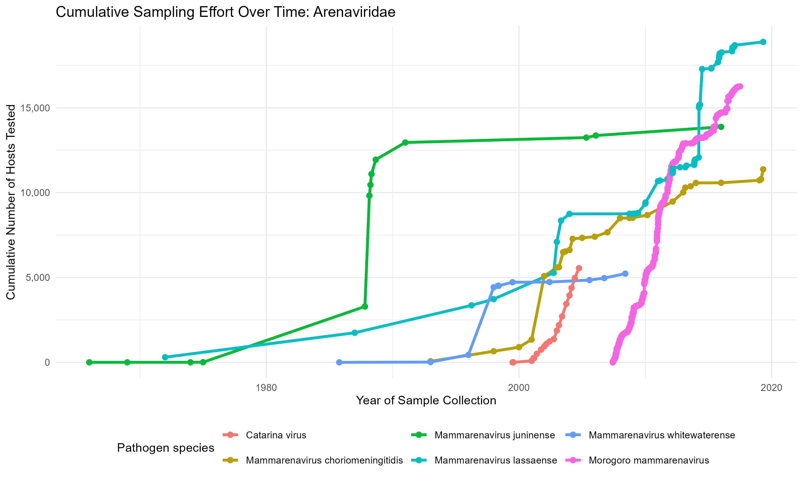

# Synthesising Arena- and Hantavirus data from rodents to understand current known host distributions and viral pathogens

David Simons, Ricardo Rivero, and Steph Seifert

Rodents are global hosts of zoonotic pathogens and potential hosts of novel pathogens of epidemic potential. Existing efforts to catalogue host-pathogen associations in these species are limited by global datasets which lack temporal and geographic specificity. Current research is hindered by spatial-, host taxa- and temporal biases within these datasets that are challenging to quantify. Recent work within the Verena consortium has synthesised publicly available data on Alpha- and Beta-coronaviruses in bats which provides a template for this work to be expanded to rodents. In this proposal, I outline a project to expand on a database produced during my PhD studies on rodent-pathogen associations in West Africa to a global scale and incorporating additional virus-host features which will support future hypothesis-testing. The database produced will provide a novel and accessible resource to explore a range of questions at a global scale about rodents and their pathogens. The produced data will be deposited within the Global Biodiversity Information Facility to support wider re-use as they continue to expand their GBIF health programme.

The project is proposed to be limited to two important, globally distributed, rodent-associated virus families in the order Bunyavirales, Hantaviridae and Arenaviridae, which contain several known zoonoses. These viruses have similarities in genomic architecture, segmented and negative sense, which allow us to ask questions about viral evolution, geography and niche-overlap. A literature search of peer-reviewed and pre-printed articles, alongside ecological reports and “grey” literature will be conducted with data extraction. Extracted data will contain information on host presence, the number of individuals identified, trapping or sampling effort, temporo-spatial information, and results from pathogen assays. Where possible, database records will be associated with pathogen sequences stored on repositories including GenBank and pathogenesis studies from experimental challenges in laboratory models. An initial search and data extraction from a sample of studies have been conducted to construct the database aligned to Darwin Core Terms and to pilot data abstraction steps (see this repository). We will use these data to test the hypothesis that niche overlap facilitates viral reassortment between species and that reassortment is more likely to be detected between closely related viruses. 

Recombination is dampened in negative sense RNA viruses relative to positive sense RNA viruses which undergo homologous recombination. The segmented genomic architecture of Bunyavirales allows for reassortment of viral genomic segments that facilitates rapid acquisition of mutations that may contribute to host breadth, replication dynamics, transmission and stability, or pathogenesis. Viral reassortment is driven by both ecological factors (e.g. host overlap) and molecular compatibility (e.g. coinfection of a single cell with two virus particles, functional compatibility of reassorted segments). Using a Bayesian stochastic search variable selection and GLM framework implemented in BEAST v2, we will determine the relative contributions of ecological, geographic, and molecular factors contributing to cross-species transmission and reassortment in rodent-associated arenaviruses and hantaviruses. We will perform co-phylogenetic analysis on available pathogen and host sequences to investigate adaptation of these viruses to rodent hosts. 
   
This project will provide an additional source of data for researchers across the Verena consortium and beyond. Future research could include exploration of changes in host or pathogen presence and the potential for spatio-temporal analysis of pathogen sharing. Based on prior work, I anticipate that data synthesis can be completed within a 3-month timeline, with initial searches and screening of the literature in month 1, and data extraction in months 2-3. Phylogenomic and generalized linear models can be implemented in months 4-6 including computational time. 

## Useful resources

https://www.bv-brc.org/ - BACTERIAL AND VIRAL BIOINFORMATICS RESOURCE CENTER  
https://www.ncbi.nlm.nih.gov/labs/virus/vssi/#/ - NCBI VIRUS   
https://www.neonscience.org/ - NEON 

# RShiny Application :computer:

A companion application is being developed to display the contained information. This interactive application will allow the dataset to be explored, subset and downloaded for subsequent reuse. This is being developed in a separate Github project called [arenavirus_hantavirus_app](https://github.com/DidDrog11/arenavirus_hantavirus_app). A draft of the application based on a pilot of 9 studies is available, hosted on [Shinyapp.io](https://diddrog11.shinyapps.io/arenavirus_hantavirus_app/)

# Data abstraction

Data from studies meeting inclusion criteria will be abstracted into a Google sheet. The current version (v2) is available at the following [link](https://docs.google.com/spreadsheets/d/14eW_YwSP6EWWuDrnsvDX-vwTi-7KnVyRdYL8FDqYivk/edit?usp=sharing), the sheet can be commented on but not modified. Five sheets have been created to capture the required data. Column titles where appropriate have been harmonised to the [Darwin Core Terms](https://dwc.tdwg.org/terms/) for subsequent submission to the [Global Biodiversity Information Facility](https://www.gbif.org/publishing-data) database. The column names, accepted values and DWC reference (where applicable), are shown below.

   
   
Descriptive sheet :books:

This sheet will contain the general information about included studies. Data contributing to the dataset will have a single row, if there are studies which are complementary and the data has been pooled from the same sampling activity additional articles will be contained in the `linked_manuscripts` field. 

| Variable name | Description | Values | DWC term link |
| --- | -- | -- | -- |
| study_id | An identifier for the included study | numeric | NA |
| pubmed_id | The Pubmed ID of the included study | numeric | NA |
| bibliographicCitation | Full link to the DOI or webpage hosting the study | string | [link](https://dwc.tdwg.org/list/#dcterms_bibliographicCitation) |
| identifiedBy | The first author of the included study | string | [link](https://dwc.tdwg.org/list/#dwc_identifiedBy) |
| datasetName | The title of the included study | string | [link](https://dwc.tdwg.org/list/#dwc_datasetName) |
| journal | The journal of publication | string | NA |
| study_design | The method of sampling of small rodents and pathogens | protected string currently `prospective rodent sampling`, `purposeful rodent sampling`, `sampling around cases and control locations`, `not described` | NA |
| sampling_effort | A measure of the intensity of sampling effort | string. Ideally capturing trap-nights | NA |
| data_access | A descriptor of the availability of included data | protected string currently `summarised data` | NA |
| linked_manuscripts | An identifier for manuscripts where data is separated across publications to prevent duplication of records | NA |
| rightsHolder | A description of whether the copyright remains with the author or publisher | string | [link](https://dwc.tdwg.org/list/#dcterms_rightsHolder) |
| license | A description of the permissions associated with the included study | string | [link](https://dwc.tdwg.org/list/#dcterms_license) |

   
   
Rodent sheet :mouse:

Each occurrence of a species will have a single record. If the study breaks down occurrences by date and location this will be replicated here. If summary data only is available across the locations of sampling or the entire study the data will be grouped as reported.

| Variable name | Description | Values | DWC term link |
| --- | -- | -- | -- |
| rodent_record_id | A unique identifier of the rodent species, trapped at a specific location (decimalLatitude and decimalLongitude) and time point (eventDate). Will be converted to a unique occurrenceID  | numeric | [occurrenceID](https://dwc.tdwg.org/list/#dwc_occurrenceID) |
| study_id | A linking value to the `study_id` in the `Descriptive sheet` | numeric | NA |
| eventDate | The date-time or interval where the occurrence or sampling occurred. Dates conform to ISO 8601-1:2019 | date | [link](https://dwc.tdwg.org/list/#dwc_eventDate) |
| basisOfRecord | The nature of the data record | protected string, most likely `Human observation` for live trapping | [link](https://dwc.tdwg.org/list/#dwc:basisOfRecord) |
| taxonRank | The rank of the identification of the occurrence | protected string, typically `species`, `genus` or `family` | [link](https://dwc.tdwg.org/list/#dwc:taxonRank) |
| genus | The name of the genus in which the occurrence is from | string | [link](https://dwc.tdwg.org/list/#dwc_genus) |
| scientificName | The full scientific name at the lowest level taxonomic rank that is identified | string | [link](https://dwc.tdwg.org/list/#dwc_scientificName) |
| locality | The specific description of the sampling location in the included study, this will be the highest resolution at which occurrences are identified | string | [link](https://dwc.tdwg.org/list/#dwc_locality) |
| country | The name of the country in which the locality occurs | string | [link](https://dwc.tdwg.org/list/#dwc_country) |
| verbatimLocality | This will contain a description of the locality that may be helpful for additional analysis but does not provide location data to higher resolution (i.e., the habitat type sampled). | string | [link](https://dwc.tdwg.org/list/#dwc_verbatimLocality) |
| coordinate_resolution | A description of the resolution of the subsequent coordinates, this will be used to estimate a `coordinateUncertaintyInMeters` | string | [coordinateUncertaintyInMeters](https://dwc.tdwg.org/list/#dwc_coordinateUncertaintyInMeters) |
| decimalLatitude | Latitude of sampling site to the highest resolution provided in a study. Non decimal coordinates will be converted at the point of extraction to EPSG:4326 | numeric | [link](https://dwc.tdwg.org/list/#dwc_decimalLatitude) |
| decimalLongitude | Longitude of sampling site to the highest resolution provided in a study. Non decimal coordinates will be converted at the point of extraction to EPSG:4326 | numeric | [link](https://dwc.tdwg.org/list/#dwc_decimalLongitude) |
| occurrenceStatus | Whether the occurrence was detected as present or absent at the sampling location, for the purposes here this is more correctly termed detection and non-detection | protected string, `Present` or `Absent` | [link](https://dwc.tdwg.org/list/#dwc_occurrenceStatus) |
| individualCount | The number of individuals present at the location and time of the occurrence | numeric | [link](https://dwc.tdwg.org/list/#dwc_individualCount) |

   
   
Pathogen sheet :biohazard:

Pathogen data will be extracted as presented in included studies. If multiple pathogens or multiple assays for the same pathogen have been reported each of these will be given an occurrence record. These data will be linked back to the sampled rodents where possible.

| Variable name | Description | Values | DWC term link |
| --- | -- | -- | -- |
| pathogen_record_id | A unique identifier of the pathogen species, using a specific detection method, from rodents of the same species, trapped at the same location at the same time, will be converted to a unique occurrenceID in conjuction with the `rodent_record_id` | numeric |  [occurrenceID](https://dwc.tdwg.org/list/#dwc_occurrenceID) |
| associated_rodent_record_id | A link to the `rodent_record_id` from which the pathogens were sampled in the `Rodent sheet` | numeric | NA |
| grouping | A descriptor of how these pathogens are grouped. (e.g.,  at the `study`, `habitat` or `host` level) | string | NA |
| study_id | A linking value to the `study_id` in the `Descriptive sheet` | numeric | NA |
| eventDate | The date-time or interval where the occurrence or sampling occurred. Dates conform to ISO 8601-1:2019 | date | [link](https://dwc.tdwg.org/list/#dwc_eventDate) |
| pathway | A term used to describe how an organism came to be in a given place at a given time, will generally be `parasites on animal` | protected string | [link](https://dwc.tdwg.org/list/#dwc_pathway) |
| basisOfRecord | The nature of the data record | protected string, most likely `Material sample` for pathogen assays | [link](https://dwc.tdwg.org/list/#dwc:basisOfRecord) |
| host_genus | The genus of the host sampled for the pathogen | string | NA |
| associatedTaxa | A term to link the pathogen to its host organism | string | [link](https://dwc.tdwg.org/list/#dwc_associatedTaxa) |
| locality | The specific description of the sampling location in the included study, this will be the highest resolution at which occurrences are identified | string | [link](https://dwc.tdwg.org/list/#dwc_locality) |
| country | The name of the country in which the locality occurs | string | [link](https://dwc.tdwg.org/list/#dwc_country) |
| verbatimLocality | This will contain a description of the locality that may be helpful for additional analysis but does not provide location data to higher resolution (i.e., the habitat type sampled). | string | [link](https://dwc.tdwg.org/list/#dwc_verbatimLocality) |
| coordinate_resolution | A description of the resolution of the subsequent coordinates, this will be used to estimate a `coordinateUncertaintyInMeters` | string | [coordinateUncertaintyInMeters](https://dwc.tdwg.org/list/#dwc_coordinateUncertaintyInMeters) |
| decimalLatitude | Latitude of sampling site to the highest resolution provided in a study. Non decimal coordinates will be converted at the point of extraction to EPSG:4326 | numeric | [link](https://dwc.tdwg.org/list/#dwc_decimalLatitude) |
| decimalLongitude | Longitude of sampling site to the highest resolution provided in a study. Non decimal coordinates will be converted at the point of extraction to EPSG:4326 | numeric | [link](https://dwc.tdwg.org/list/#dwc_decimalLongitude) |
| taxonRank | The rank of the identification of the pathogen occurrence | protected string, typically `species`, `genus` or `family` | [link](https://dwc.tdwg.org/list/#dwc:taxonRank) |
| family | The name of the family in which the pathogen occurrence is from | string | [link](https://dwc.tdwg.org/list/#dwc_family) |
| scientificName | The full scientific name at the lowest level taxonomic rank that is identified | string | [link](https://dwc.tdwg.org/list/#dwc_scientificName) |
| identificationRemarks | A description of the method of identification of the pathogen (i.e., `antibody`, `pcr`) | string | [link](https://dwc.tdwg.org/list/#dwc_identificationRemarks) |
| occurrenceStatus | Whether the pathogen occurrence was detected as present or absent at the sampling location, for the purposes here this is more correctly termed detection and non-detection | protected string, `Present` or `Absent` | [link](https://dwc.tdwg.org/list/#dwc_occurrenceStatus) |
| occurrenceRemarks | Further information on the pathogen occurrence, here it will be limited to the number of individuals assayed using the `identificationRemarks` method for the pathogen | numeric | [link](https://dwc.tdwg.org/list/#dwc_occurrenceRemarks) |
| number_negative | To allow for inconclusive results the number determined to be negative is extracted | numeric | NA |
| organismQuantity | The number of individuals assayed that were found to be positive for the pathogen using the assay | numeric | [link](https://dwc.tdwg.org/list/#dwc_organismQuantity) |
| number_inconclusive | If the number of individuals returning an inconclusive assay is returned this will be extracted | numeric | NA |

   
Pathogen sequences sheet :dna:
  
  
For subsequent analysis we will obtain the sequences from NCBI where available. This sheet is to collate the accession numbers of these sequences and relate them back to the rodents from which they were sampled. It may be that more accurate geographic and temporal data is available on NCBI than reported within the manuscripts. The highest resolution data that is available will be used for subsequent analysis.

| Variable name | Description | Values | DWC term link |
| --- | -- | -- | -- |
| sequence_record_id | A unique identifier for the sequence of a pathogen | numeric | NA |
| associated_rodent_record_id | A link to the `rodent_record_id` from which the pathogens were sampled in the `Rodent sheet` | numeric | NA |
| study_id | A linking value to the `study_id` in the `Descriptive sheet` | numeric | NA |
| host_genus | The genus of the host sampled for the pathogen | string | NA |
| associatedTaxa | A term to link the pathogen sequence to its host organism | string | [link](https://dwc.tdwg.org/list/#dwc_associatedTaxa) |
| scientificName | The full scientific name | string | [link](https://dwc.tdwg.org/list/#dwc_scientificName) |
| accession_number | The record number in NCBI of the pathogen sequence | string | NA |

   
Known zoonoses sheet :stethoscope:
  

All included pathogens will be designated as known or not-known zoonoses. Currently this will be performed by a manual search of all the recorded micro-organsisms at species level. There may be additional resources that can contribute to this.

| Variable name | Description | Values |
| --- | -- | -- |
| pathogen_species_id | A unique identifier of the pathogen species | numeric |
| pathogen_family | The family of the pathogen species | string |
| pathogen_species | The name of the pathogen species | string |
| known_zoonosis | Whether there are records of this pathogen causing disease in humans from exposure to an animal host | logical |
| disease_name | The name(s) of diseases associated with infection from this zoonosis | string |
| icd_10 | The ICD-10 code associated with this/these disease(s) | string |
| disease_reference | A link, prefereably a DOI to an article demonstrating whether this pathogen is classed as a zoonosis | string |

# Data Cleaning and Processing Pipeline

The raw data abstracted from the literature is processed through a sequential, modular pipeline of R scripts located in the root of this repository. The goal of this pipeline is to produce a clean, standardized, and relational database that is ready for analysis.

A core principle of this pipeline is that the metadata from the original published manuscripts is treated as the primary source of truth, especially for high-resolution spatio-temporal and host-pathogen linkage information. The pipeline is designed to use this rich, manuscript-derived data to enrich and provide context for the corresponding sequence data, whose metadata on public repositories like GenBank is often less complete.

# Pipeline Scripts

The pipeline is executed by running the following scripts in numerical order. Each script performs a distinct task, saving its output to be used as the input for the next script.     

+  `00_load_data.R`: Data Acquisition & Environment Setup. This script loads all required R packages. It downloads the raw v2 and v3 data from their respective Google Sheets, performs initial ID standardization (e.g., ensuring study_id is unique across extractors), and saves local copies to the data/raw_data/ directory. This ensures the rest of the pipeline can run on a stable, local version of the data. It also downloads world administrative boundary shapefiles for later use.
+  `01_01_clean_citations.R`: Citation & Study Metadata Consolidation. This script combines the citation information from the v2 and v3 data sources into a single master table of all publications reviewed for the project. It also creates several quality control tables that categorize studies based on their extraction status (e.g., single_extractions, multiple_extractions, excluded).
+  `02_01_clean_descriptives.R`: Standardization of Study-Level Descriptive Data. This script focuses on the "descriptive" sheets, cleaning and standardizing key study-level metadata such as publication year, sampling effort terminology, data access levels, and data resolution.
+  `03_01_clean_rodent.R`: Initial Host Data Quality Control. A preliminary QC step that consolidates the v2 and v3 host data and performs checks for the uniqueness of host record IDs.
+  `03_02_create_taxa_matching_host.R`: Host Taxonomy Standardization (Manual Rules & GBIF API). This is a major taxonomic cleaning step. It extracts all unique host species and genus names, applies a large set of manual cleaning rules to correct misspellings and synonyms, and then queries the Global Biodiversity Information Facility (GBIF) API using the taxize package to resolve names to a standardized taxonomic hierarchy. Results are cached to prevent redundant API calls on subsequent runs.
+  `03_03_clean_rodent_taxa.R`: Application of Standardized Host Taxonomy. This script takes the manually cleaned names and the GBIF taxonomic lookup tables generated in the previous step and joins them to the main host dataset, adding standardized columns for species, genus, family, etc.
+  `03_04_clean_coords.R`: Host Spatial Data Cleaning & Validation. This script cleans and validates all geographic coordinates. It standardizes country names, converts them to ISO codes, and then performs a spatial validation to ensure each coordinate pair falls within its stated country's boundary, flagging any mismatches.
+  `03_05_clean_locality.R (Areal Taxonomy)`: Areal Taxonomy Enrichment (GADM). This script enriches the spatial data by downloading administrative boundary shapefiles from the GADM database and performing a spatial join to add the corresponding ADM1, ADM2, and ADM3 regions (e.g., province, county) for each host record.
+  `03_05_clean_rodent_temporal.R (Temporal Cleaning)`: Host Temporal Data Cleaning. A complex script dedicated to parsing the eventDate column. It handles dozens of different date and date-range formats (e.g., YYYY-MM-DD, Month YYYY, YYYY-YYYY) to produce standardized start_date and end_date columns for every record.
+  `03_07_clean_trapping_effort.R`: Trapping Effort Standardization. Parses the free-text trapEffort fields to extract numeric trap-night data where available and categorizes the type of effort reported.
+  `03_08_impute_nondetections.R`: Imputation of Non-Detections. An important epidemiological step. For studies that report clear sampling effort, this script creates "zero-count" (non-detection) records for host species that were known to be present in the overall study but were not detected at a specific site or session. This provides true absence data for ecological modeling.
+  `04_01_clean_pathogen.R`: Pathogen Data Consolidation and Standardization. This script mirrors the host cleaning process for the pathogen data. It consolidates raw v2 and v3 data, applies a manual dictionary to clean virus names, queries the NCBI Taxonomy database for a standardized hierarchy, standardizes assay terminology (e.g., 'PCR', 'Serology'), and validates the numeric tested and positive counts.
+  `05_01_clean_sequences.R`: Initial Sequence Data Consolidation & Linkage. Consolidates the raw sequence tables, creates unique IDs, links sequence records to their corresponding host and pathogen records, and creates flags to identify any taxonomic mismatches between the GenBank record and the manuscript-derived data.
+  `05_02_enrich_sequence_data.R`: Sequence Metadata Enrichment & Cleaning. This script uses the robust fetch_accession_data function to query the NCBI API in batches for all unique accession numbers. It downloads and parses rich metadata for each sequence. It then performs a final cleaning pass on the newly downloaded data, including standardizing country names from the geo_loc_name field. This script also contains the call to download the full FASTA sequences.
+  `06_01_generate_qa_report.qmd`: Final Data Quality Assurance Report. A Quarto script that generates a comprehensive HTML report summarizing the final dataset's dimensions, completeness, consistency, and distributions. It serves as a final validation of the entire pipeline.
+  `07_01_finalize_database.R`: Final Database Assembly and Formatting. The last script in the pipeline. It takes all cleaned tables and applies a final polish, enforcing consistent snake_case column names and a logical, thematic column order. The output is the final, analysis-ready database object.

# Final Database Structure

The final output of the pipeline is a single .rds file named Project_ArHa_database_{date}.rds. This file contains a list object named arha_db with the following five consistently formatted data frames (tibbles):

   
citations: The master table of all publications reviewed for the project. (<code>arha_db$citations</code>) :page_facing_up:
  
   
   This table serves as the master bibliographic reference for every publication that was reviewed for the project.

| Variable name |	Description |	Values |
| --- | -- | -- |
| study_id |	A unique identifier for the study extraction, acts as a link across all datasets. |	factor |
| full_text_id |	A unique identifier for the manuscript, linking to the original source text. |	factor |
| doi |	The Digital Object Identifier for the manuscript. |	character |
| author	| The author(s) of the publication as a single string. |	character |
| publication_year |	The four-digit year of publication. |	numeric |
| title |	The title of the publication. |	character |
| publication_title |	The title of the journal or book where the work was published. |	character |
| volume |	The journal volume. |	character |
| issue |	The journal issue. |	character |
| decision |	The screening decision for the publication (e.g., "Include", "Exclude"). |	character |
| reason |	The reason for the exclusion decision. |	character |
| processed |	A flag indicating if the citation was processed (y/n). |	character |
| extractor |	The name of the person who extracted the data. |	character |
| rights |	Copyright information associated with the publication. |	character |
| extra |	Any extra, unprocessed information from the citation manager. |	character    |

   
 descriptives: Standardized study-level metadata. (<code>arha_db$descriptives</code>) :mag: 
  
    
   This table contains standardized study-level metadata extracted from each publication, describing the methods and scope of the original research.
   
   | Variable name | Description |	Values |
   | --- | -- | -- |
   |  study_id |	A unique identifier for the study extraction. |	factor |
   | full_text_id |	A unique identifier for the manuscript. |	factor |
   | publication_title |	The title of the publication. |	character |
   | publication_year   |  The four-digit year of publication. |	numeric |
   | publication_year_status |	A flag indicating if the publication year was valid.  |	character   |
   | author_first |	The first author of the publication.   |	character   |
   | author_status |	A flag indicating if the author was present or missing. |	factor |
   | sampling_effort_raw |	The original, unaltered text describing sampling effort. |	character |
   | sampling_effort_clean |	A cleaned version of the sampling effort if it was a time period. |	character |
   | sampling_effort_status |	A standardized category for the type of sampling effort reported. |	factor |
   | trap_nights |	The number of trap nights reported, extracted from the raw text. |	numeric |
   | n_sessions |	The number of sampling sessions reported, extracted from the raw text. | 	numeric |
   | data_access_level |	A standardized category for data availability (e.g., individual, summarised). |	factor |
   | data_resolution_clean |	A standardized category for the resolution of the data (e.g., site, site-session). |	factor |
   | data_access_raw |	The original, unaltered text describing data access. |	character |
   | data_resolution_raw |	The original, unaltered text describing data resolution. |	character |
   | notes |	Any notes made by the data extractor. |	character |
   | data_checker |	The name of the person who checked the data extraction. |	character |
    

    

   
host: The central table of the database. (<code>arha_db$host</code>) :rat: 

   
   This is the central table of the database. Each row represents a unique host species occurrence at a specific location and time, primarily derived from the original manuscripts.
   
   | Variable name |	Description |	Values |
   | --- | -- | -- |
   | host_record_id |	A unique identifier for the host occurrence record (primary key). |	factor |
   | study_id |	Identifier linking to the citations and descriptives tables. |	factor |
   | host_species |	The scientific name of the host, standardized against GBIF. |	character |
   | host_genus   |	The genus of the host, standardized against GBIF.  |	character   |
   | host_family  |	The family of the host, standardized against GBIF. |	character   |
   | host_order   |	The order of the host, standardized against GBIF.  |	character   |
   | host_class   |	The class of the host, standardized against GBIF.  |	character   |
   | taxon_rank   |	The lowest taxonomic rank resolved for the record. |	factor   |
   | gbif_id   |	The unique identifier from the Global Biodiversity Information Facility.   |	numeric  |
   | country   |	The country of the occurrence, cleaned and standardized. |  character   |
   | iso3c  |	The 3-letter ISO 3166-1 alpha-3 country code.   |	character   |
   | latitude  |	The decimal latitude of the occurrence (WGS84). |	numeric  |
   | longitude |	The decimal longitude of the occurrence (WGS84).   |	numeric  |
   | coord_status |	A flag indicating the validity of the coordinates (valid, missing, illogical).   |	character   |
   | gadm_country |	The country name from the GADM administrative boundaries database.   |	character   |
   | gadm_adm1 |	The administrative level 1 (e.g., state, province) from GADM. |	character   |
   | gadm_adm2 |	The administrative level 2 (e.g., county, district) from GADM. |	character   |
   | gadm_adm3 |	The administrative level 3 (e.g., municipality) from GADM.  |	character   |
   | start_date   |	The start date of the sampling event, parsed into a standard format. |	datetime |
   | end_date  |	The end date of the sampling event, parsed into a standard format.   |	datetime |
   | temporal_resolution   |	The resolution of the original date information (e.g., day_range, year_only). |	factor   |
   | number_of_hosts |	The number of individuals observed for this occurrence.  |	numeric  |
   | trap_nights_clean  |	The number of trap nights for the sampling event, extracted and cleaned.   |	numeric  |
   | trap_nights_status |	A standardized category for the trap night data.   |	factor   |
   | host_species_original |	The original, unaltered scientific name from the source data.  |	character   |
   | host_genus_original   |	The original, unaltered genus from the source data.   |	character   |
   | country_raw  |	The original, unaltered country name from the source data.  |	character   |
   | locality_raw |	The original, unaltered locality description from the source data.   |	character   |
   | verbatim_locality_raw |	The original, unaltered verbatim locality description from the source data.   |	character   |
   | event_date_raw  |	The original, unaltered date string from the source data.   |	character   |
   

   
pathogen: Contains pathogen assay results, linked to the host table by host_record_id. (<code>arha_db$pathogen</code>) :biohazard: 

   
   This table contains pathogen assay results, with each row representing a unique pathogen-assay combination for a given host occurrence.
   
   |  Variable name |   Description |	Values |
   | --- | -- | -- |
   |  pathogen_record_id   |	A unique identifier for the pathogen assay record. |	factor   |
   |  host_record_id |	Identifier linking to the host table.  |	factor   |
   |  study_id	Identifier  | linking to the citations and descriptives tables.   |	factor   |
   |  pathogen_species_cleaned   |	The scientific name of the pathogen, cleaned using a manual dictionary. |	character   |
   |  pathogen_family   |	The family of the pathogen, cleaned and standardized. |	factor   |
   |  taxonomic_level   |	The taxonomic level of the pathogen identification (e.g., species, genus). |	factor   |
   |  pathogen_species_ncbi   |	The scientific name of the pathogen, resolved against the NCBI Taxonomy.   |	character   |
   |  ncbi_id  |	The unique identifier from the NCBI Taxonomy database.   |	character   |
   |  assay |	The standardized assay category (e.g., PCR, Serology).   |	factor   |
   |  number_tested  |	The number of host individuals tested in this assay.  |	numeric  |
   |  number_positive   |	The number of host individuals that tested positive.  |	numeric  |
   |  number_negative   |	The number of host individuals that tested negative.  |	numeric  |
   |  number_inconclusive  |	The number of host individuals with an inconclusive test result.  |	numeric  |
   |  pathogen_species_original  |	The original, unaltered pathogen name from the source data. |	character   |
   |  pathogen_family_original   |	The original, unaltered pathogen family from the source data.  |	character   |
   |  assay_raw   |	The original, unaltered text describing the assay method.   |	character   |
   |  note  |	Any notes made by the data extractor for this record. |	character   |
   

   

   
 sequence: Contains sequence information and metadata. While the metadata is primarily obtained directly from GenBank, this table is linked to the host and pathogen tables. (<code>arha_db$sequence</code>) :dna: 

   
   |  Variable name  |	Description |	Values   |
   | --- | -- | -- |
   |  sequence_record_id   |	A unique identifier for the sequence record. |	factor   |
   |  host_record_id |	Identifier linking to the host table.  |	factor   |
   |  pathogen_record_id   |	Identifier linking to the pathogen table. |	factor   |
   |  study_id |	Identifier linking to the citations and descriptives tables.   |	factor   |
   |  sequence_type  |	The type of sequence (e.g., Pathogen, Host). |	character   |
   |  query_accession   |	The original accession number provided in the source manuscript.  |	character   |
   |  resolution_status |	A flag indicating if the query accession was successfully found on NCBI.   |	character   |
   |  accession_primary |	The primary (version-less) accession number from the NCBI record. |	character   |
   |  definition  |	The definition or title line from the NCBI record. |	character   |
   |  seq_length  |	The length of the sequence in base pairs. |	integer  |
   |  molecule_type  |	The type of molecule (e.g., RNA, cRNA).   |	character   |
   |  strandedness   |  The strandedness of the sequence (e.g., single, double). |	character   |
   |  host  |	The host species as reported in the NCBI record's feature table.  |	character   |
   |  pathogen |	The pathogen/organism name from the NCBI record.   |	character   |
   |  isolate  |	The isolate name from the NCBI record's feature table.   |	character   |
   |  gene_name   |	The gene name from the NCBI record's feature table.   |	character   |
   |  protein_name   |	The protein product name from the NCBI record's feature table. |	character   |
   |  country  |	The country, cleaned from the NCBI record.   |	character   |
   |  iso3c |	The 3-letter ISO code derived from the NCBI country information.  |	character   |
   |  locality |	The locality information, cleaned from the NCBI record.  |	character   |
   |  country_raw |	The original, unaltered country/geo_loc_name string from the NCBI record.  |	character   |
   |  collection_date   |	The collection date, parsed from the NCBI record.  |	datetime |
   |  create_date |	The date the record was created on NCBI, parsed.   |	datetime |
   |  update_date |	The date the record was last updated on NCBI, parsed. |	datetime |
   |  host_species_original   |	The original, unaltered host species name from the source manuscript.   |	character   |
   |  host_species_clean   |	The cleaned host species name from the host table. |	character   |
   |  pathogen_species_original  |	The original, unaltered pathogen name from the source manuscript. |	character   |
   |  pathogen_species_clean  |	The cleaned pathogen name from the pathogen table. |	character   |
   

# Database Descriptive Summary

The following figures provide a high-level summary of the taxonomic, epidemiological, and geographic scope of the final Project ArHa database. All figures were generated using the 99_01_descriptive_figures.qmd script.

## Taxonomic Completeness of Sampling

These figures assess the completeness of the dataset by comparing the sampled host and pathogen taxa against their known diversity.

### Host Phylogenies

The phylogenies below, derived from the Open Tree of Life, visualize the taxonomic distribution of sampling effort across the orders Rodentia and Eulipotyphla. Each tip represents a recognized species. The colour of both the tips (species) and the internal nodes (genera, families) indicates the sampling status within the ArHa database. This allows for a rapid visual assessment of which clades have been sampled for arenaviruses, hantaviruses, or both, and highlights major taxonomic gaps in the surveillance landscape.
Pathogen Taxonomic Trees

These diagrams represent the known species diversity within the Arenaviridae and Hantaviridae families, based on the NCBI Taxonomy database. The tips are coloured to indicate whether a given virus species is represented by at least one record in the ArHa dataset.

## Pathogen Prevalence Distributions

These plots visualize the distribution of pathogen prevalence. Each row on the y-axis represents a single pathogen species. Within each of these the points represent the sampling of a single host species in which the pathogen was detected within a country. The box-and-whisker plots show the distribution of prevalence values from each unique study-country-host stratum. The size of each point is proportional to the number of individuals tested in that stratum.

## Geographic Sampling Effort and Distribution

These maps visualize the geographic biases and resolution of the sampling effort contained within the database.

The following maps show the density of sampling effort, calculated as the number of host detections per 1,000 km². The data is aggregated at different administrative levels (ADM0, ADM1, and ADM2) to illustrate the spatial resolution of the underlying data and highlight regions with high-intensity surveillance.

This map displays every unique sampling location in the database. The colour of each point indicates which virus family was detected at that site (Arenaviridae, Hantaviridae, or both). This provides a clear overview of the geographic distribution of surveillance and viral detections.

## Temporal Trends in Sampling Effort

This plot shows the cumulative number of collected samples for Arenaviridae and Hantaviridae over time. The x-axis represents the earliest sample collection reported at a site within a study, providing a historical perspective on temporal trends in research effort for each virus species with more than 5,000 samples within this dataset.

